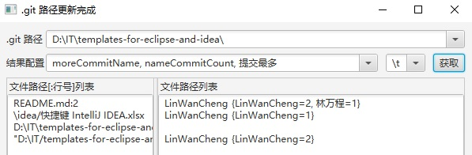

# GitTool
Find the last or most modifier and commit of multiple files in Git Path.  
gitPath, config, separator, filePath will save in save.txt.  
filePath can use "\\" or "/", Absolute path or relative path of ".git".  

查找 Git 上多个文件的最后或最多修改人和提交人。  

支持的配置参数如下：  
**blameName, blameTime,** // 最后提交人  
**nameLineCount, moreLineName,** // 最多修改行  
**lastName, lastTime,** // 最后提交人  
**nameCommitCount, moreCommitName,** // 最多提交次  
**filePath, blameLine** // 相对路径和行 

查询相关条件会被保存到 sav.txt 文件。  
文件路径列表支持绝对路径、相对路径，分割符可以是/或\，  
Shift 右击复制的带引号的路径也支持。  

用到的库 lib:  
lib\org.eclipse.jgit_4.1.1.201511131810-r.jar  
lib\slf4j-api-1.7.12.jar
